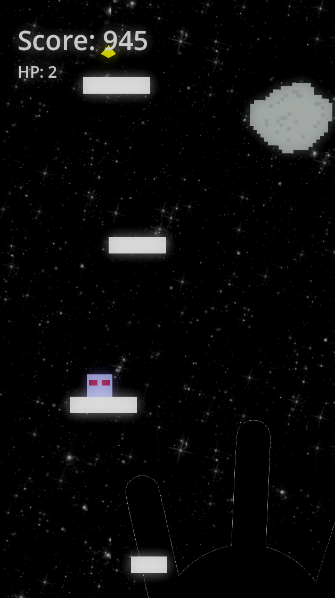

# Godot SwipeJump Game

A simple vertical platformer built with Godot. Jump between platforms, collect coins, and ascend as high as you can! Features dynamic camera, collectibles, infinite platform spawning, sound effects, difficulty scaling, and more.

## Author
**Created by gwenz2**

## Screenshots

## Features
- Responsive swipe/jump controls
- Dynamic camera effects (shake, zoom, flash)
- Infinite platform spawning and removal
- Coins and score system
- HP and fall damage
- Game Over and Main Menu UI
- Moving and thin platforms (difficulty scales with score)
- Debug overlay
- Screen wrap (Snake-style)
- Parallax starfield and special background images

## How to Play
- Drag and release to jump.
- Tap while in the air for a sudden landing.
- Avoid falling off the screen or taking too much fall damage.
- Try to reach the highest score!

## Setup
1. Open the project in Godot.
2. Run the main scene (`world.tscn`).
3. Customize assets, sounds, and settings as desired.

## Customization
- Add your own platform, coin, and background images in the `assets/` folder.
- Special background images can be set in the Main node's Inspector as image paths.
- Tweak difficulty, camera, and sound settings in the exported variables.

## Repository
https://github.com/gwenz2/Godot-SwipeJump-Game.git

## License
MIT

